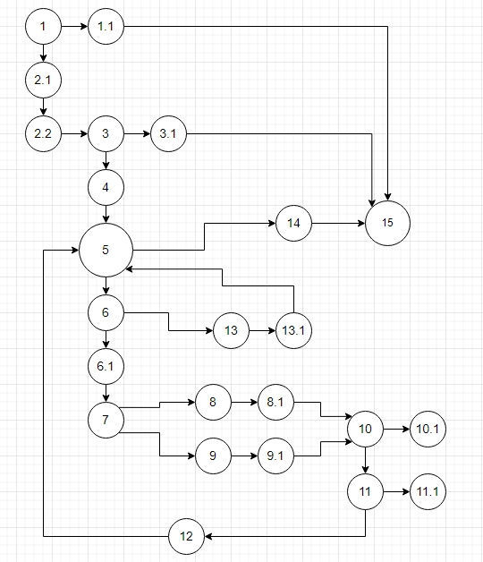

Лабораториска вежба 2 по Софтверско инженерство
Бојана Наумоска 165010

2. Control Flow Graph дијаграм

Линии во јазлите:
1 if (list.size() <= 0) 
1.1 throw new IllegalArgumentException("List length should be greater than 0");
2.1 int n = list.size();
2.2 int rootOfN = (int) Math.sqrt(n);
3 if (rootOfN x rootOfN != n) 
3.1 throw new IllegalArgumentException("List length should be a perfect square");
4 List<String> numMines = new ArrayList<>();
5 for (int i = 0; i < n; i++)
6 if (!list.get(i).equals("#"))
6.1  int num = 0;
7 if ( (i % rootOfN != 0 && list.get(i - 1).equals("#")) || (i % rootOfN != rootOfN - 1 && list.get(i + 1).equals("#")) )
8 if ( (i % rootOfN != 0 && list.get(i - 1).equals("#")) && (i % rootOfN != rootOfN - 1 && list.get(i + 1).equals("#")) )
8.1  num += 2;
9 else
9.1 num  += 1;
10 if (i - rootOfN >= 0 && list.get(i - rootOfN).equals("#"))
10.1  num++;
11 if (i + rootOfN < n && list.get(i + rootOfN).equals("#"))
11.1  num++;
12 numMines.add(String.valueOf(num));
13 else
13.1 numMines.add(list.get(i));
14 return numMines;
15 end of program

3. Цикломатска комплексност

Цикломатската комплексност изнесува 6.

	28 ребра - 24 јазли + 2 = 6
	
4. Every statement тест случаи

Тест случаите по Every statement методата се дадени во excel датотеката EveryStatementTests.xlsx

Објаснување за:
public void everyStatementTesting()
public void everyStatementTesting()

Во овој тест метод имам опфатено 6 тест случаи:
Случај 1:
Кога имаме празна листа.
Со помош на assertEquals(exception.getMessage(),"List length should be greater than 0"); споредуваме дали се исти реченицата добиена од исклучокот и мојата тест реченица. ќ
Случај 2:
Листата е составена од "#","#","#","#","#", бидејќи n=5 не може да се добие добар квадрат, повторно праќаме исклучок и ги испраќаме речениците со исклучок assertEquals(exception.getMessage(),"List length should be a perfect square");
Случај 3,4,5,6:
Листата е составена од "0","#","0","#". Со овој тест случај треба да добиеме листа "1","#","1","#" а споредбата ја правам со методот assertEquals( test1list2, SILab2.function(test1list1) ); Тест случаевите се менуваат во наредните низи односно тоа се следниве:
Дадена е  0","#","#","#"
Очекувам да добијам "2","#","#","#"
Дадена е"#","#","#","#"
Очекувам да добијам "#","#","#","#"
Дадена е "0","0","0","0"
Очекувам да добијам "0","0","0","0"

5. Every branch тест случаи

Тест случаите по Every Branch методата се дадени во excel датотеката EveryBranchTests.xlsx

Во овој тест метод имам опфатено 6 тест случаи:
Случај 1:
Кога имаме празна листа.
Со помош на assertEquals(exception.getMessage(),"List length should be greater than 0"); споредуваме дали се исти реченицата добиена од исклучокот и мојата тест реченица. ќ
Случај 2:
Листата е составена од "#","#","#","#","#", бидејќи n=5 не може да се добие добар квадрат, повторно праќаме исклучок и ги испраќаме речениците со исклучок assertEquals(exception.getMessage(),"List length should be a perfect square");
Случај 3,4,5,6:
Листата е составена од "0","#","0","#". Со овој тест случај треба да добиеме листа "1","#","1","#" а споредбата ја правам со методот assertEquals( test1list2, SILab2.function(test1list1) ); Тест случаевите се менуваат во наредните низи односно тоа се следниве:
Дадена е  0","#","#","#"
Очекувам да добијам "2","#","#","#"
Дадена е"#","#","#","#"
Очекувам да добијам "#","#","#","#"
Дадена е "0","0","0","0"
Очекувам да добијам "0","0","0","0"

Истите случаеви се искористени. 

